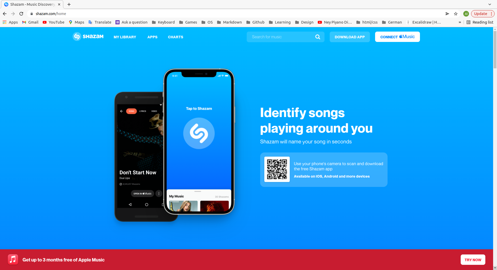

## Shazam Homepage

**[Test this app yourself](https://aliceheneghan.github.io/shazam-clone/)**

---

#### Navigation

- [About Project](#about-project)
  - _Description_
  - _Developed With_
- [Contact](#contact)
  - _Mail_
  - _GitHub_
  - _LinkedIn_
- [Used Tools](#used-tools)
  - _Fonts_
  - _Design_
  - _Icons_
  - _Colors_

---

### About Project

##### Description

_Shazam - clone_
Create a webpage using Bootstrap to recreate the Shazam landing page.

##### Developed With

- [x] _HTML5_
- [ ] _CSS3_
- [ ] _SASS_
- [ ] _SCSS_
- [ ] _JavaScript_
- [ ] _React_
- [x] _Bootstrap_
- [ ] _npm_

---

### Contact

Mail: <heneghan31@mail.com> 
GitHub: [aliceheneghan](https://github.com/aliceheneghan) 
LinkedIn: [your linkedIn](https://linkedin.com/in/alicehen)

---

### Used Tools

- [Bootstrap](https://getbootstrap.com/)
  - Licensed under MIT (https://github.com/twbs/bootstrap/blob/main/LICENSE)
- [Visual Studio Code](https://code.visualstudio.com/)

---

This project is for **educational** purposes.
